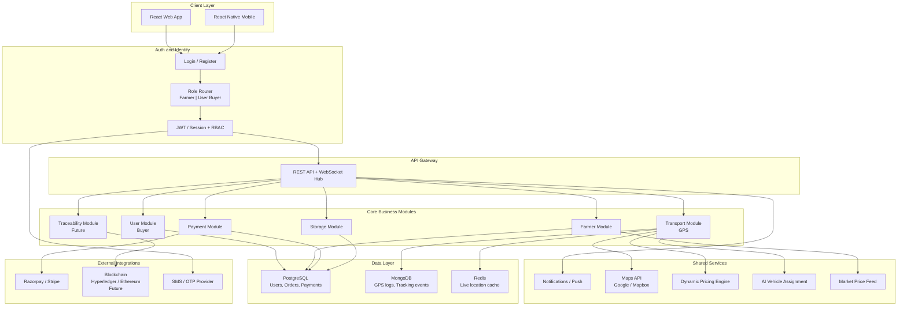
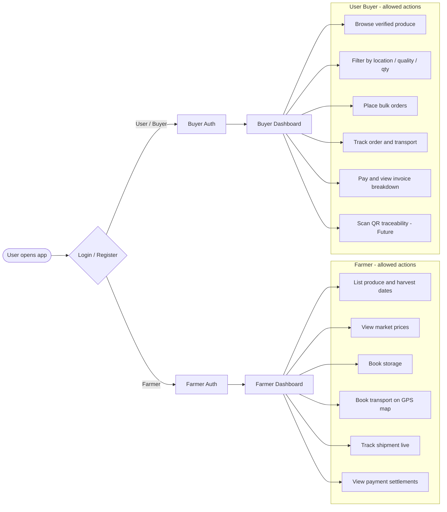
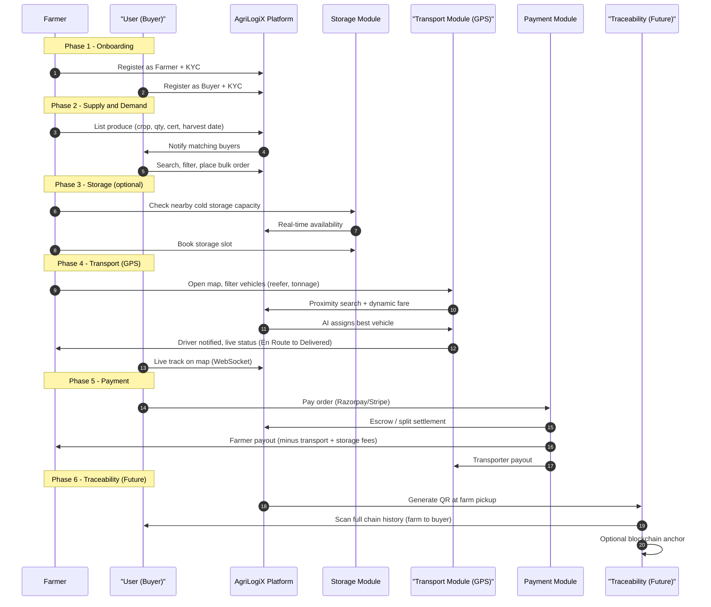
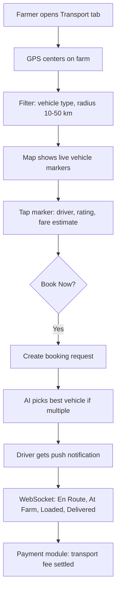
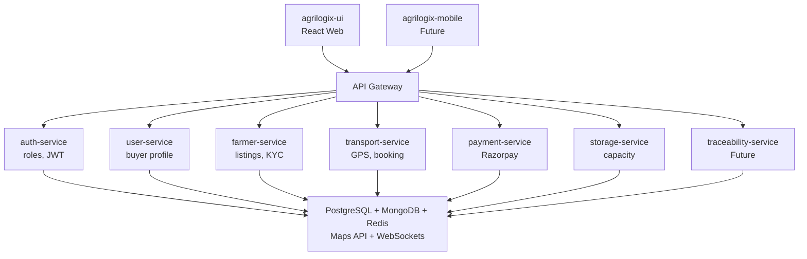

# AgriLogiX — System Architecture

> Based on [About_project.md](./About_project.md)

> **Note:** All diagrams below use [Mermaid](https://github.blog/2022-02-14-include-diagrams-markdown-files-mermaid/). They render automatically when you view this file on GitHub — no extra setup needed.

AgriLogiX is a **farm-to-fork supply chain platform**. Two roles log in today: **Farmer** and **User (Buyer)**. After auth, each role gets a different dashboard and permissions. The core journey is: **list/source produce → store (optional) → transport → pay → trace**. Transport is GPS-driven with live tracking; payments are transparent settlements; traceability (QR/blockchain) is planned for full chain visibility.

---

## 1. High-Level System Architecture

---

## 2. Role-Based Login and Routing

### Extra Login Logic (Recommended)

| Logic | Purpose |
|--------|---------|
| Role at signup | Farmer vs User selected once; KYC differs per role |
| OTP / phone verify | Common in agri platforms for trust |
| Farmer KYC | Land docs, crop certs, quality certifications |
| Buyer KYC | Business GST, export license (for exporters) |
| JWT + role claims | API enforces `farmer:*` vs `buyer:*` scopes |
| Route guards | Farmer cannot access buyer checkout; buyer cannot list produce |

---

## 3. End-to-End Business Flow (Start to End, incl. Future)

---

## 4. Module Breakdown

| Module | Owner role | Key responsibilities | Status |
|--------|------------|----------------------|--------|
| **User (Buyer)** | User | Sourcing, filters, bulk orders, order tracking | Core |
| **Farmer** | Farmer | Produce listing, price discovery, booking storage/transport | Core |
| **Transport** | Farmer (books), system (assigns) | GPS map, proximity search, booking, ETA, ratings | Core |
| **Payment** | Both | Invoices, escrow, split payouts, fee breakdown | Core |
| **Storage** | Farmer | Capacity view, dynamic booking | Core (doc) |
| **Traceability** | Both | QR scan, chain-of-custody, blockchain | Future |

---

## 5. Transport Module (Logical Sub-Flow)

---

## 6. Backend Service Map (Suggested)

---

## 7. Data Flow Summary

1. **Login** → role → scoped token → correct dashboard
2. **Farmer lists** → catalog indexed → buyers discover
3. **Buyer orders** → order created → notifications to farmer
4. **Storage booked** (if needed) → capacity reserved
5. **Transport booked** → GPS match → AI assign → live track
6. **Payment** → buyer pays → platform splits to farmer + transporter (+ storage)
7. **Future trace** → QR at each hop → buyer scans full history

---

## 8. Tech Stack Alignment

| Layer | Choice |
|-------|--------|
| Frontend | React (web) / React Native (mobile) |
| Backend | Node.js or Python (Django) |
| DB | PostgreSQL + MongoDB |
| Real-time | WebSockets / Socket.io |
| Maps | Google Maps / Mapbox |
| Payments | Razorpay / Stripe |
| Traceability | Hyperledger / Ethereum (optional, future) |
