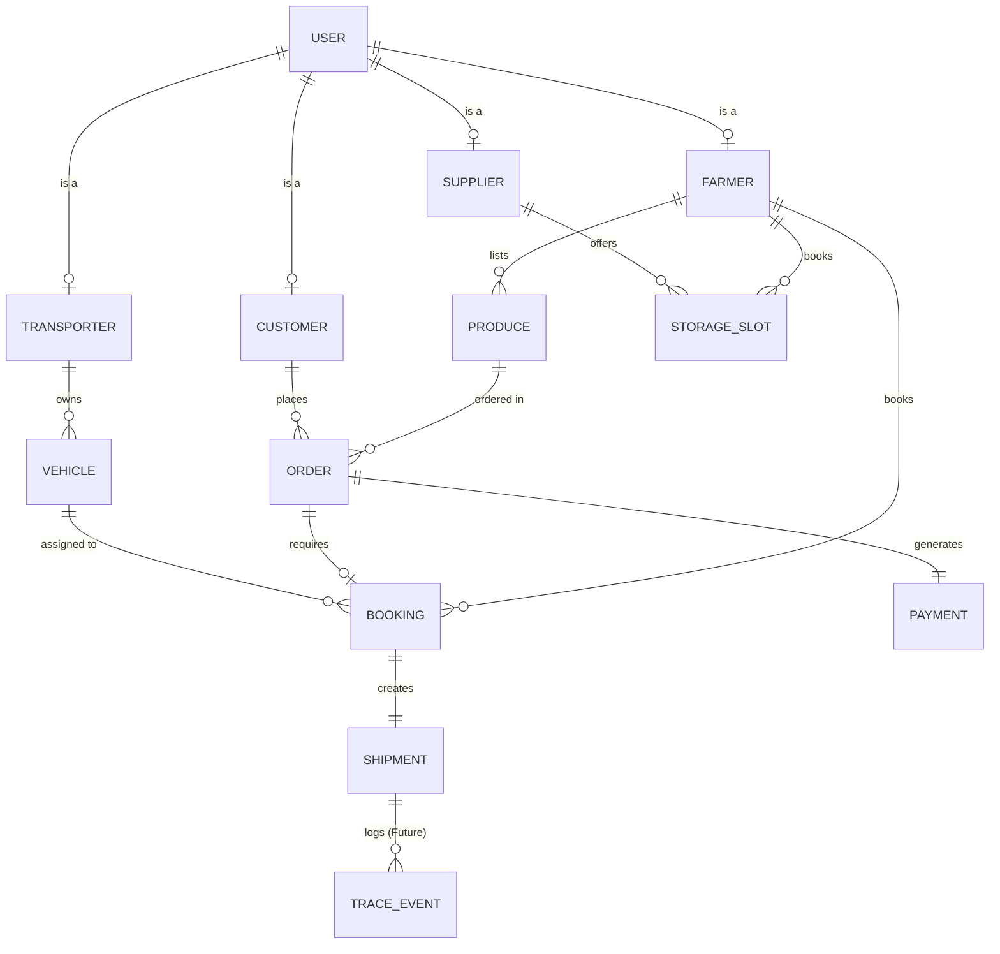
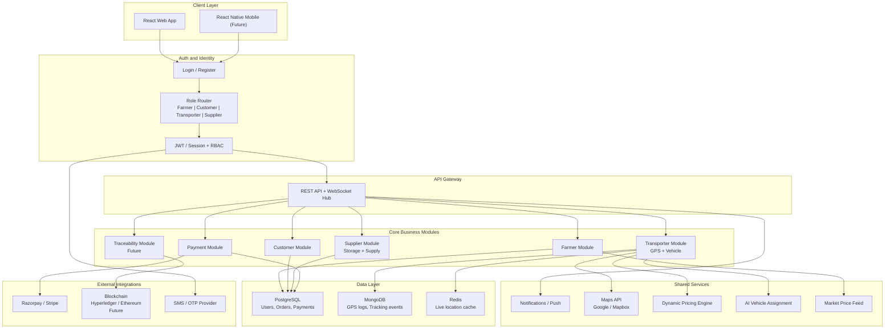
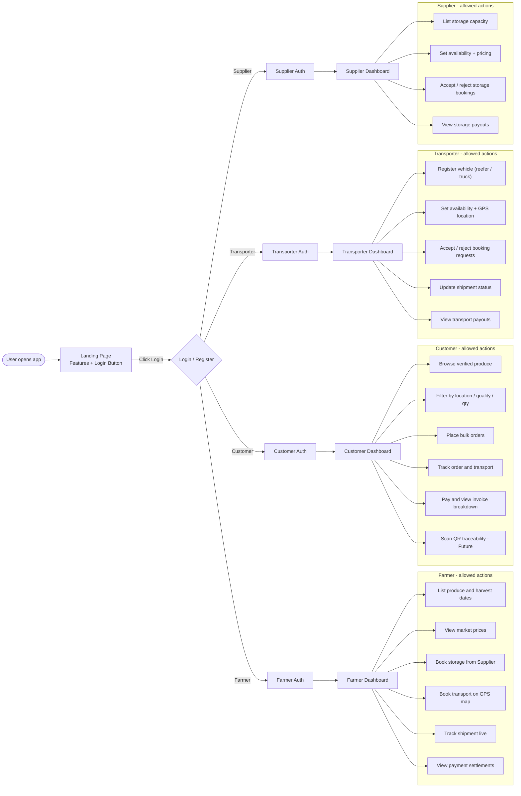
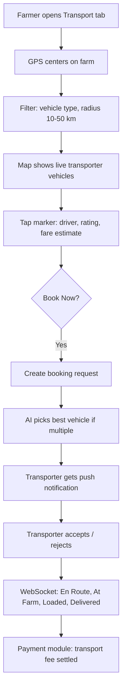
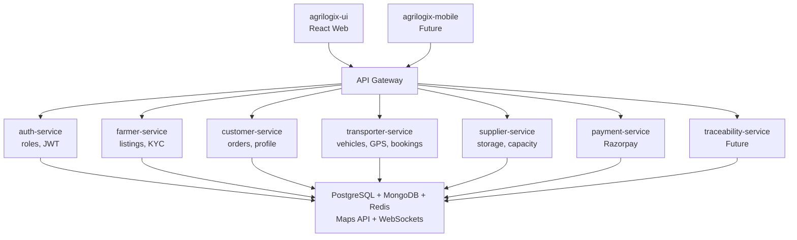

# AgriLogiX — System Architecture

> Based on [About_project.md](./About_project.md)

> **Note:** All diagrams below use [Mermaid](https://github.blog/2022-02-14-include-diagrams-markdown-files-mermaid/). They render automatically when you view this file on GitHub — no extra setup needed.

AgriLogiX is a **farm-to-fork supply chain platform**. Four roles log in today: **Farmer**, **Customer (Buyer)**, **Transporter**, and **Supplier**. After auth, each role gets a different dashboard and permissions. The core journey is: **list/source produce → store (optional) → transport → pay → trace**. Transport is GPS-driven with live tracking; payments are transparent settlements; traceability (QR/blockchain) is planned for full chain visibility.

---

## 0. Project Status — Just Begun

This project has **just started**. We are currently in the **declaration phase**:

- ✅ Roles and entities are declared (see below)
- ✅ High-level architecture is documented
- ✅ Landing page + navbar structure is defined (UI only, no backend yet)
- ✅ Login button + role-based login page (UI only, not functional yet)
- 🚧 Feature buttons/divs are visible on the landing page but not wired
- ❌ No API integration, no database, no real auth yet
- ❌ Transport, Payment, Storage, Traceability — all deferred

**What this means:** Every button/div on the landing page is a **placeholder** representing a feature we intend to deliver. Nothing is functional yet — this is a declaration of scope, not an implementation.

---

## 1. Declared Entities and Relationships

### 1.1 Entities

| Entity | Owned by Role | Key Attributes |
|--------|---------------|----------------|
| **User** | Base entity for all roles | id, name, email, phone, password_hash, role, kyc_status, created_at |
| **Farmer** | User (role=farmer) | land_docs, crop_certs, harvest_calendar, farm_location |
| **Customer (Buyer)** | User (role=customer) | business_gst, delivery_address, order_history |
| **Transporter** | User (role=transporter) | vehicle_type, tonnage, license_no, gps_enabled, rating |
| **Supplier** | User (role=supplier) | supply_category, warehouse_location, bulk_capacity |
| **Produce** | Farmer | crop_name, quantity, quality_grade, harvest_date, price_per_unit, cert_url |
| **Order** | Customer | produce_id, quantity, total_price, status, delivery_address |
| **Vehicle** | Transporter | type (reefer/truck), capacity, current_location, availability |
| **Booking** | Farmer/Customer | vehicle_id, pickup_location, drop_location, fare, status |
| **StorageSlot** | Supplier | location, capacity, available_from, price_per_day |
| **Payment** | System | order_id, amount, split (farmer/transporter/supplier), status |
| **Shipment** | System | order_id, vehicle_id, status (En Route → At Farm → Loaded → Delivered), live_location |
| **TraceEvent** | System (Future) | shipment_id, event_type, timestamp, blockchain_hash |

### 1.2 Relationships



### 1.3 Role Permission Matrix

| Action | Farmer | Customer | Transporter | Supplier |
|--------|--------|----------|-------------|----------|
| List produce | ✅ | ❌ | ❌ | ❌ |
| Browse produce | ✅ | ✅ | ❌ | ✅ |
| Place order | ❌ | ✅ | ❌ | ❌ |
| Accept/reject order | ✅ | ❌ | ❌ | ❌ |
| Offer storage | ❌ | ❌ | ❌ | ✅ |
| Book storage | ✅ | ❌ | ❌ | ❌ |
| Register vehicle | ❌ | ❌ | ✅ | ❌ |
| Accept transport booking | ❌ | ❌ | ✅ | ❌ |
| Track shipment | ✅ | ✅ | ✅ | ❌ |
| Make payment | ❌ | ✅ | ❌ | ❌ |
| Receive payout | ✅ | ❌ | ✅ | ✅ |
| View settlements | ✅ | ✅ | ✅ | ✅ |

---

## 2. High-Level System Architecture



---

## 3. Role-Based Login and Routing (4 Roles)



### Extra Login Logic

| Logic | Purpose |
|--------|---------|
| Role at signup | Farmer / Customer / Transporter / Supplier selected once; KYC differs per role |
| OTP / phone verify | Common in agri platforms for trust |
| Farmer KYC | Land docs, crop certs, quality certifications |
| Customer KYC | Business GST, export license (for exporters) |
| Transporter KYC | Vehicle license, insurance, GPS device ID |
| Supplier KYC | Warehouse license, storage capacity proof |
| JWT + role claims | API enforces `farmer:*`, `customer:*`, `transporter:*`, `supplier:*` scopes |
| Route guards | Each role cannot access other roles' dashboards |

---

## 4. End-to-End Business Flow (Start to End, incl. Future)

```mermaid
sequenceDiagram
    autonumber
    participant F as Farmer
    participant C as Customer
    participant T as Transporter
    participant S as Supplier
    participant APP as AgriLogiX Platform
    participant TR as "Transport Module (GPS)"
    participant PAY as Payment Module
    participant TRACE as "Traceability (Future)"

    Note over F,C,T,S: Phase 1 - Onboarding
    F->>APP: Register as Farmer + KYC
    C->>APP: Register as Customer + KYC
    T->>APP: Register as Transporter + Vehicle KYC
    S->>APP: Register as Supplier + Warehouse KYC

    Note over F,C,T,S: Phase 2 - Supply and Demand
    F->>APP: List produce (crop, qty, cert, harvest date)
    APP->>C: Notify matching customers
    C->>APP: Search, filter, place bulk order

    Note over F,C,T,S: Phase 3 - Storage (optional, Supplier)
    F->>S: Check nearby cold storage capacity
    S->>APP: Real-time availability
    F->>S: Book storage slot

    Note over F,C,T,S: Phase 4 - Transport (GPS, Transporter)
    F->>TR: Open map, filter vehicles (reefer, tonnage)
    TR->>T: Proximity search + dynamic fare
    APP->>T: AI assigns best vehicle
    T->>F: Driver notified, live status (En Route to Delivered)
    C->>APP: Live track on map (WebSocket)

    Note over F,C,T,S: Phase 5 - Payment
    C->>PAY: Pay order (Razorpay/Stripe)
    PAY->>APP: Escrow / split settlement
    PAY->>F: Farmer payout (minus transport + storage fees)
    PAY->>T: Transporter payout
    PAY->>S: Supplier payout (storage fee)

    Note over F,C,T,S: Phase 6 - Traceability (Future)
    APP->>TRACE: Generate QR at farm pickup
    TRACE->>C: Scan full chain history (farm to customer)
    TRACE->>TRACE: Optional blockchain anchor
```

---

## 5. Module Breakdown

| Module | Owner role | Key responsibilities | Status |
|--------|------------|----------------------|--------|
| **Farmer** | Farmer | Produce listing, price discovery, booking storage/transport | Core |
| **Customer (Buyer)** | Customer | Sourcing, filters, bulk orders, order tracking, payment | Core |
| **Transporter** | Transporter | Vehicle registration, GPS location, booking acceptance, live status | Core |
| **Supplier** | Supplier | Storage capacity listing, booking acceptance, storage payouts | Core |
| **Payment** | All | Invoices, escrow, split payouts, fee breakdown | Core |
| **Traceability** | All | QR scan, chain-of-custody, blockchain | Future |

---

## 6. Transport Module (Logical Sub-Flow)



---

## 7. Landing Page — Declared Features (UI Only)

> **This is the current state.** All buttons/divs below are **placeholders** — they show intended features but are not wired to backend yet.

### 7.1 Navbar

| Element | Behaviour (Current) |
|---------|---------------------|
| AgriLogiX logo | Static, links to `/` |
| Home | Static link |
| Features | Scrolls to features section |
| About | Static link |
| Contact | Static link |
| **Login** | Navigates to `/login` page (UI only) |
| **Register** | Navigates to `/register` page (UI only) |

### 7.2 Login Page (UI Only — Not Functional)

- Shows **4 role tabs**: Farmer | Customer | Transporter | Supplier
- Each tab shows a login form (email, password)
- **Submit button does nothing** — it's a placeholder
- "Forgot password" link is static
- "Register" link navigates to register page (UI only)

### 7.3 Landing Page Feature Sections (Divs/Buttons)

| Section | Content (Placeholder) | Button/Div |
|---------|----------------------|------------|
| **Hero** | "Farm-to-Fork Supply Chain Platform" | "Get Started" button (UI only) |
| **For Farmers** | List produce, view market prices, book storage/transport | "Learn More" button |
| **For Customers** | Browse produce, place orders, track shipment | "Learn More" button |
| **For Transporters** | Register vehicle, accept bookings, live GPS | "Learn More" button |
| **For Suppliers** | List storage, manage capacity, payouts | "Learn More" button |
| **How It Works** | 5-step flow diagram (List → Store → Transport → Pay → Trace) | Static |
| **Features Grid** | 8 feature cards (GPS, Payments, Traceability, etc.) | Static divs |
| **Stats** | Placeholder numbers (Farmers: 0, Orders: 0, etc.) | Static divs |
| **Testimonials** | Placeholder quotes | Static divs |
| **CTA** | "Join the Platform" | "Sign Up" button (UI only) |
| **Footer** | Links, social icons, copyright | Static |

---

## 8. Backend Service Map (Suggested)



---

## 9. Data Flow Summary

1. **Login** → role (Farmer/Customer/Transporter/Supplier) → scoped token → correct dashboard
2. **Farmer lists** → catalog indexed → customers discover
3. **Customer orders** → order created → notifications to farmer
4. **Storage booked** (if needed) → Supplier confirms → capacity reserved
5. **Transport booked** → GPS match → AI assign → Transporter accepts → live track
6. **Payment** → customer pays → platform splits to farmer + transporter + supplier
7. **Future trace** → QR at each hop → customer scans full history

---

## 10. Tech Stack Alignment

| Layer | Choice |
|-------|--------|
| Frontend | React (web) / React Native (mobile, future) |
| Backend | Node.js or Python (Django/FastAPI) |
| DB | PostgreSQL + MongoDB + Redis |
| Real-time | WebSockets / Socket.io |
| Maps | Google Maps / Mapbox |
| Payments | Razorpay / Stripe |
| Traceability | Hyperledger / Ethereum (optional, future) |

---

## 11. Project Schedule (20 Weeks)

Total duration: **20 weeks**. Weeks **1–4** are planned in detail below. Weeks **5–20** list remaining work.

### Weeks 1–4 — Detailed Weekly Plan

| Week | Focus | Tasks | Deliverable |
|------|--------|--------|-------------|
| **Week 1** | Foundation | Repo setup (web + API skeleton), env/config, DB schema draft (users, roles), landing page with navbar + feature divs, login page UI (4 role tabs, non-functional), `ARCHITECTURE.md` as source of truth | Runnable UI + empty API; documented 4 roles and entities |
| **Week 2** | Auth and RBAC | Register/login with role select (Farmer / Customer / Transporter / Supplier), OTP stub, JWT + route guards, 4 dashboard shells | Role-based login working; wrong-role routes blocked |
| **Week 3** | Farmer + Customer core (v1) | Farmer: produce listing. Customer: browse/filter produce. Shared user profile | Create listing as Farmer; search listings as Customer |
| **Week 4** | Orders + wiring | Customer places bulk order; Farmer sees incoming orders; order status (pending / accepted / rejected); notification placeholders | End-to-end listing → order |

**Week 1–4 exit criteria:** four roles can log in, a farmer can list produce, a customer can order it, and the rest of the chain is clearly deferred.

### Weeks 5–20 — Remaining Work

| Weeks | Module / theme | Remaining work |
|-------|----------------|----------------|
| **5–6** | Farmer module (complete) | Price discovery, listing edit/delete, cert uploads, harvest calendar |
| **7–8** | Supplier module | Storage capacity listing, real-time availability, booking management |
| **9–12** | Transporter module (GPS) | Maps, proximity search, vehicle filters, booking request, driver ratings, dynamic fare, AI vehicle assignment, WebSocket live status |
| **13–15** | Payment module | Razorpay/Stripe checkout, invoice with cost breakdown, escrow/split settlement (farmer + transporter + supplier), payout views |
| **16–17** | Notifications and ops | Push/in-app alerts, admin/ops basics, ratings after delivery |
| **18** | Traceability (future slice) | QR at pickup, chain history; optional blockchain stub |
| **19** | Hardening | Integration testing, bug fixes, security, performance |
| **20** | Close-out | Demo script, docs, UI polish, buffer |

### 20-Week Snapshot

| Phase | Weeks | Outcome |
|-------|--------|---------|
| Setup + auth + landing page | 1–2 | 4-role identity + UI shell |
| Farmer + Customer + Supplier | 3–8 | Marketplace + storage loop |
| Transporter + Payments | 9–15 | Logistics + money |
| Trace + polish + demo | 16–20 | Visibility, stability, presentation |

---

# Question 2: Website Generation Prompt

> **Use this prompt with any AI website builder (v0.dev, Lovable, Bolt.new, Cursor, Claude, GPT, etc.) to generate the AgriLogiX landing page + login UI.**

```text
You are building the FRONTEND UI ONLY for a project called "AgriLogiX" — a farm-to-fork supply chain platform.

IMPORTANT: This is a UI-only build. Do NOT wire any backend, API, database, or real authentication. All buttons and forms are placeholders. Clicking "Login" should navigate to a login page (client-side routing only). Submitting the login form should do nothing (or show a toast saying "Coming soon"). No API calls. No real auth. No data persistence.

Use: React + Vite + Tailwind CSS + React Router. Keep components clean and reusable.

=== PAGES TO BUILD ===

1. LANDING PAGE (route: /)

Structure:
- Navbar (sticky, top):
  - Left: "AgriLogiX" logo text
  - Center: Home | Features | How It Works | About | Contact (anchor links, smooth scroll)
  - Right: "Login" button (navigates to /login) and "Register" button (navigates to /register)
- Hero section:
  - Headline: "Farm-to-Fork Supply Chain Platform"
  - Subheadline: "Connecting Farmers, Customers, Transporters, and Suppliers — from harvest to delivery."
  - Two buttons: "Get Started" (→ /register) and "Learn More" (scrolls to features)
  - Background: soft green/earth gradient, subtle farm illustration
- "Built For You" section — 4 role cards:
  - Farmer card: "List your produce, book storage and transport, track shipments, view payouts." Button: "Learn More"
  - Customer card: "Browse verified produce, place bulk orders, track delivery, pay securely." Button: "Learn More"
  - Transporter card: "Register your vehicle, accept bookings, share live GPS location, earn payouts." Button: "Learn More"
  - Supplier card: "List storage capacity, manage bookings, receive storage payouts." Button: "Learn More"
  - Each card: icon, title, description, outline button
- "How It Works" section — 5-step horizontal flow:
  1. List Produce → 2. Store (Optional) → 3. Transport (GPS) → 4. Pay → 5. Trace
  - Each step: number badge, icon, short label
- "Features" grid — 8 cards (2 rows × 4 cols):
  - GPS Live Tracking
  - Secure Payments (Escrow + Split)
  - Storage Booking
  - AI Vehicle Assignment
  - Dynamic Pricing
  - Multi-Role Dashboards
  - QR Traceability (Coming Soon)
  - Market Price Feed
  - Each card: icon, title, 1-line description
- "Stats" strip (placeholder numbers):
  - Farmers: 0 | Customers: 0 | Transporters: 0 | Suppliers: 0
  - Small note: "Launching soon — join the waitlist"
- "Testimonials" section (3 placeholder cards with generic quotes and avatar placeholders)
- "CTA" section:
  - Headline: "Be part of the farm-to-fork revolution"
  - Button: "Sign Up" (→ /register)
- Footer:
  - Columns: Product (Features, How It Works, Pricing), Company (About, Contact, Careers), Legal (Privacy, Terms)
  - Social icons (placeholder)
  - Copyright: "© 2026 AgriLogiX. All rights reserved."

2. LOGIN PAGE (route: /login)

Structure:
- Centered card layout, clean and minimal
- Top: "Welcome back to AgriLogiX"
- Role tabs (4 tabs, horizontal): Farmer | Customer | Transporter | Supplier
  - Active tab highlighted in green
  - Switching tabs changes the form heading (e.g., "Farmer Login")
- Form fields:
  - Email
  - Password
  - "Remember me" checkbox
  - "Forgot password?" link (static)
- Submit button: "Login as [Role]" (does nothing on click; optionally show toast "Coming soon")
- Bottom: "Don't have an account? Register" (→ /register)
- Back to Home link at top-left

3. REGISTER PAGE (route: /register)

Structure:
- Similar centered card
- Role selector (4 options as radio cards): Farmer | Customer | Transporter | Supplier
- Form fields based on role (UI only):
  - Common: Name, Email, Phone, Password, Confirm Password
  - Farmer: Land docs upload (placeholder), Crop certs (placeholder)
  - Customer: Business GST (optional), Delivery address
  - Transporter: Vehicle type (dropdown), Tonnage, License number
  - Supplier: Warehouse location, Storage capacity
- Submit button: "Create Account" (does nothing; show toast "Coming soon")
- Bottom: "Already have an account? Login" (→ /login)

=== DESIGN GUIDELINES ===

- Color palette: earthy greens (#2E7D32, #66BB6A), warm cream (#FFF8E1), dark charcoal (#1B1B1B), accent orange (#F57C00)
- Typography: Inter or Poppins. Headings bold, body regular.
- Rounded corners (rounded-xl), soft shadows, generous whitespace
- Icons: use lucide-react or heroicons
- Fully responsive: mobile → tablet → desktop
- Smooth scroll for anchor links
- Hover states on all buttons and cards
- No real images needed — use icon placeholders or gradient blocks
- Keep it clean, modern, and agricultural-themed (not corporate-cold)

=== ROUTING ===

Use React Router:
- / → Landing Page
- /login → Login Page
- /register → Register Page
- All other links (#features, #about, etc.) are in-page anchors

=== CONSTRAINTS ===

- No backend
- No API calls
- No real authentication
- No database
- Login/Register forms are visual only — clicking submit does nothing (or shows a "Coming soon" toast)
- Every feature button is a placeholder
- Keep the code modular: separate components for Navbar, Hero, RoleCard, FeatureCard, StepCard, Footer, RoleTabs, LoginForm, RegisterForm

=== DELIVERABLE ===

A complete, runnable React + Vite + Tailwind project with:
- Landing page fully built with all sections above
- Login page with 4 role tabs (non-functional)
- Register page with 4 role selection (non-functional)
- Navbar with working Login navigation
- Clean, modern, agricultural-themed UI
- All placeholder buttons and divs clearly visible

Generate the full project structure with all files.
```

---

## Summary of the Two Answers

| Question | Answer |
|----------|--------|
| **Q1: Modified README** | Full `README.md` with 4 roles (Farmer, Customer, Transporter, Supplier), entity-relationship diagram, permission matrix, "just begun" declaration status, landing page feature divs, and 20-week schedule |
| **Q2: Website Generation Prompt** | A copy-paste prompt for any AI website builder to generate the AgriLogiX landing page + login/register UI (UI only, no backend, all placeholders) |
